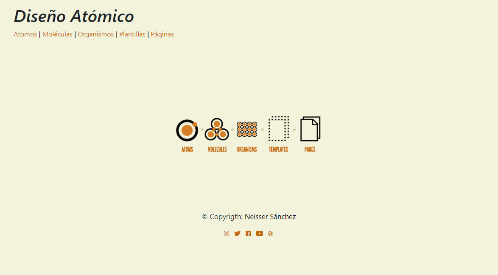

# Atomic Desing 

 Es un pequeño sitio web (Responsive) sobre la metodología del sistema atómico, lo preparé para una exposición en la Universidad.

 ## ¿Qué es Atomic Desing?
 
 Fue creada por Bard Frost, consiste de 5 elementos que están anidados uno dentro de otro.

### 1.-Átomos
Funciona de esta manera, los átomos son los elementos básicos de construcción de un sistema interactivo, un sistema digital. Son elementos que ya están dados por la plataforma y que no peuden reducirse a menos sin perder funcionalidad, son todas las etiquetas que están en una pag web, ejem: son los botones, cajas, párrafos, imagenes, todos son elementos átomicos y ya estan dados, no tenemos q hacer nada ya que están creados. 

#### 2.-Moléculas
Las moléculas son grupos de átomos unidos entre sí y son las unidades fundamentales más pequeñas de un compuesto. Sintacticamente cuando juntamos, una caja, una imagen un boton y con un texto, ahí son 4 atomos y creamos una caja de búsqueda y esta compuesta por 4 elementos átomicos que ya estaban dados, pero juntos crean un elemento q en si mismo ya  tiene un significado sintactico porque no sirven para otra cosa, esto es una Molécula.

### 3.-Organismos
Los organismos son grupos de moléculas unidas para formar una sección relativamente compleja y distinta de una interfaz.
Ejemplo: Pie de pagina, Barra de navegación, etc.

### 4.-Plantillas
Cuando combinamos muchos organismos creamos plantillas, la cual son contenedores, osea son cajas vacías a la cual vamos a insentar datos.

### 5.-Páginas
 Los organismos son grupos de moléculas unidas para formar una sección relativamente compleja y distinta de una interfaz.

### Atomic Desing GIF

> Visita mi Blog personal donde podrás encontrar documentos 
> sobre trabajos realizados en la universidad.

